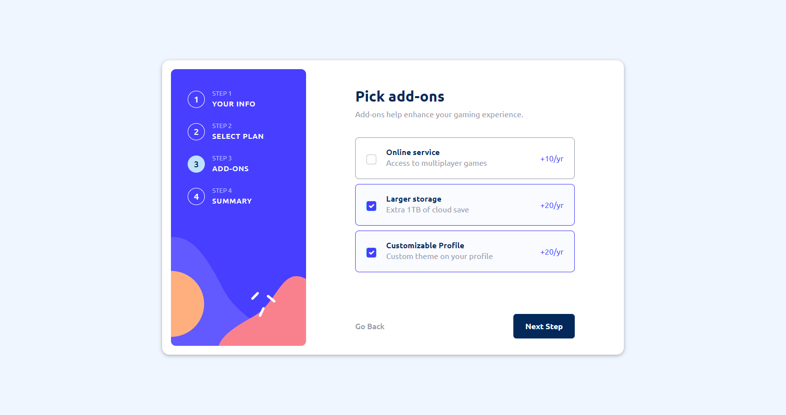

# Frontend Mentor - Multi-step form solution

This is a solution to the [Multi-step form challenge on Frontend Mentor](https://www.frontendmentor.io/challenges/multistep-form-YVAnSdqQBJ). Frontend Mentor challenges help you improve your coding skills by building realistic projects. 

### The challenge

Users should be able to:

- Complete each step of the sequence
- See a summary of their selections on the final step and confirm their order
- View the optimal layout for the interface depending on their device's screen size
- See hover and focus states for all interactive elements on the page

### Screenshot

It is my pleasure to present to you a screenshot of my solution to the multi-step-form challenge. I have worked diligently to create a user-friendly interface that guides users through the form completion process in a clear and intuitive manner. Each step of the form is displayed in a clean and visually appealing layout, with clear instructions and feedback provided at each stage. I have also implemented features such as progress bars and error messages to further enhance the user experience. Overall, I am proud of the solution I have developed and believe that it represents a significant step forward in the world of multi-step forms. I look forward to hearing your thoughts and feedback.

### Links

- Live Site URL: [Add live site URL here](https://multi-step-form-tan.vercel.app/)

### Built with

- Semantic HTML5 markup
- CSS custom properties
- SASS/SCSS
- [React](https://reactjs.org/) - JS library
- [React Hook Form](https://react-hook-form.com/) - Performant, flexible and extensible forms with easy-to-use validation.
- [React Bootstrap](https://react-bootstrap.github.io/) - React-Bootstrap replaces the Bootstrap JavaScript. Each component has been built from scratch as a true React component, without unneeded dependencies like jQuery.

## Author

- Website - [Jownsu](https://jownsu.github.io/)
- Frontend Mentor - [@jownsu](https://www.frontendmentor.io/profile/jownsu)
- Instagram - [jownsu](https://www.instagram.com/jownsu/)
- Linked In - [Jhones](https://www.linkedin.com/in/jhones-digno-866904213/)